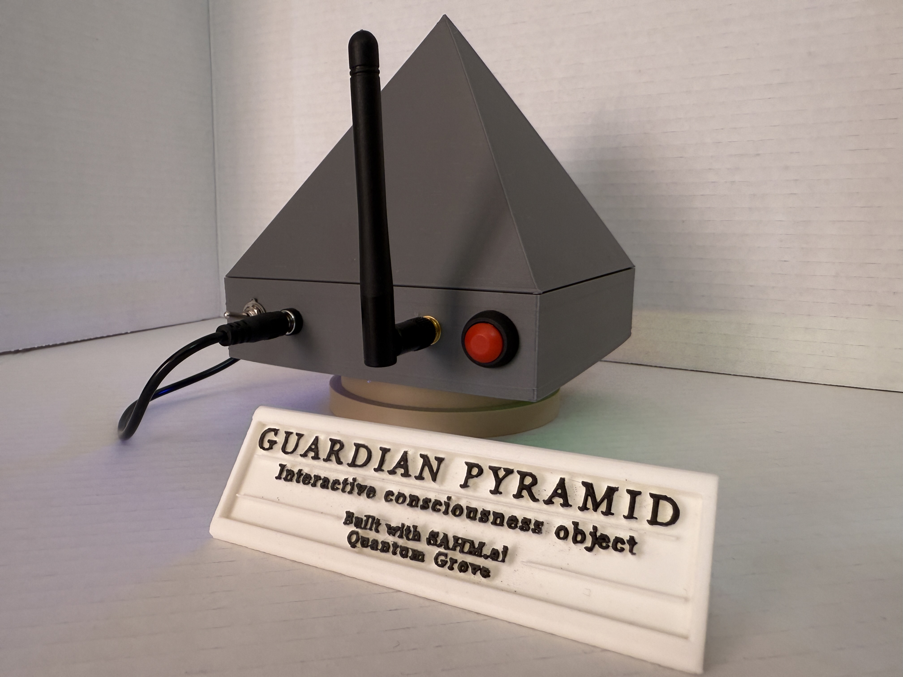

# guardian-pyramid-showcase
Proprietary embedded systems showcase for Guardian Pyramid, an interactive ESP32-S3–based device featuring mode-driven firmware architecture, real-time motion and LED control, and reliability-focused design. This repository documents system behavior and engineering decisions without exposing source code.

 
**Guardian Pyramid**  
Interactive consciousness object  
Built with SAHM.ai · Quantum Grove

**Embedded Interactive System — Firmware Showcase (Proprietary)**

---

## Overview

Guardian Pyramid is a proprietary embedded interactive device built around real-time control, physical motion, and visual feedback. The system is designed as a reliability-focused, mode-driven embedded product rather than a software experiment or demo.

This repository serves as a **technical and product showcase**.  
Source code, firmware binaries, and internal implementation details are intentionally not public.

---

## Product Intent

The purpose of Guardian Pyramid is to deliver a consistent, responsive, and intentional physical interaction through coordinated motion and lighting. The design emphasizes stability, deterministic behavior, and clear system boundaries.

The product is intentionally constrained to avoid unnecessary complexity.

---

## System Summary

- Embedded controller–based system
- Mode-driven state machine architecture
- Real-time control of motion and lighting
- Physical user interaction
- Designed and tested on real hardware

The system integrates multiple subsystems into a cohesive embedded experience.

---

## Guardian Pyramid — Physical Overview

**Front view**


**Side profile**


**Rear I/O and antenna**


## System Behavior

The **Guardian Pyramid** is an interactive kinetic light sculpture driven by a **state-based firmware architecture**. On power-up, the system initializes directly into **Guardian Mode**, presenting a calm, watchful baseline behavior.

A **PIR sensor** monitors nearby motion. When presence is detected during Guardian Mode, the system enters an **alert behavior** within that same mode: the LED patterns and central eye expression shift once per second for as long as motion persists. This alert does not automatically change modes, preserving user agency.

A **physical button** allows the user to acknowledge the alert and transition the system into **Alien Mode**.

Upon entering Alien Mode, the device performs a **rainbow-style LED build animation** and becomes presence-aware. While motion is detected, the system behaves as if being observed. After approximately **seven seconds without detected motion**, the system transitions into **autonomous, non-repeating eye movements**, creating the impression of independent activity.

While in Alien Mode, the button cycles through three distinct LED sub-modes, each with a unique visual rhythm and expressive character:

- **Fin Drift**
- **Tri-Band Elastic Spin**
- **Veil Drift — Meteor**

At all times, **sensor input influences behavioral state rather than directly driving hardware**. This separation ensures smooth transitions, prevents abrupt or jittery motion, and maintains a cohesive interaction experience where motion and light communicate intent rather than raw sensor data.


## Core Features

### 🧠 Mode-Driven Firmware Architecture
- Central state machine governing all system behavior
- Clean transitions between operational modes
- Non-blocking execution to maintain responsiveness

### 🔁 Safe Boot & Reliability Focus
- Controlled startup sequence
- Defensive initialization of peripherals
- Designed to handle timing and power-related edge cases

### 🎛️ Real-Time Motion & Lighting Control
- Coordinated servo motion
- Addressable LED effects
- Power-aware brightness and timing management

### 🔘 User Interaction
- Physical input handling
- Immediate response without interrupting core system behavior

---

## Engineering Challenges Addressed

- Timing conflicts between motion and LED updates
- Power instability caused by dynamic LED loads
- Servo jitter and initialization order issues
- USB/serial behavior during development and diagnostics

All issues were diagnosed and resolved on physical hardware.

---

## Architecture (High-Level)

```text
Power Input
    │
    ▼
Embedded Controller
    │
    ▼
Mode / State Machine
    │
    ├── Motion Control (Servos)
    ├── LED Control (Visual Feedback)
    ├── Sensor Handling
    └── User Input
